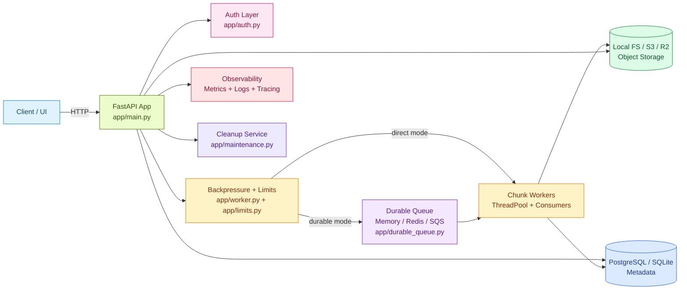
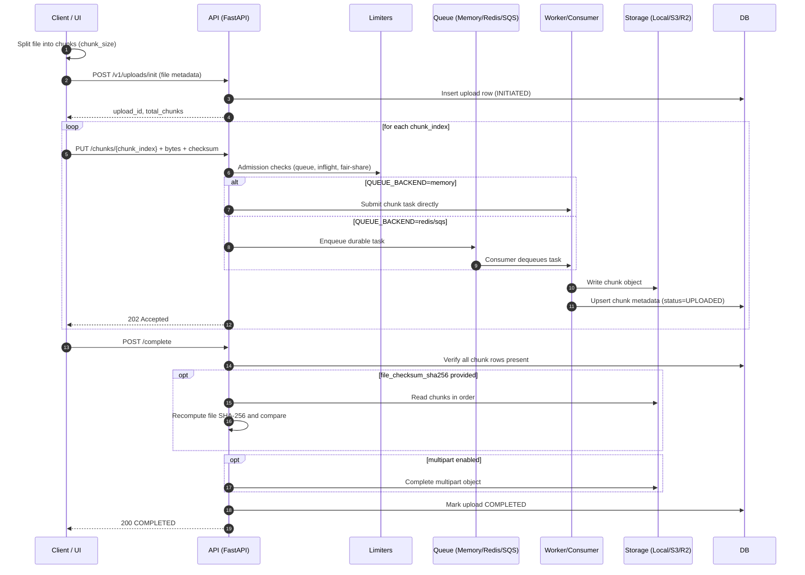
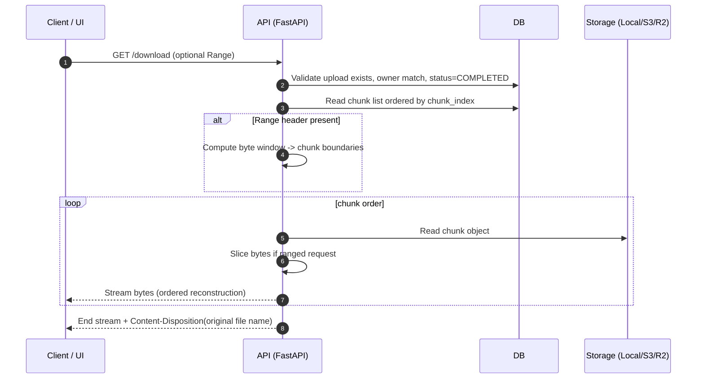

# Distributed File Service

A production-oriented backend service for high-throughput, resumable file uploads and downloads using chunked transfer, persistent metadata, backpressure controls, pluggable durable queue backends, and observability-first operations.

## Demo Video
[](https://youtu.be/INt9tzYnCMo)

[Watch on YouTube](https://youtu.be/INt9tzYnCMo)

## What This Project Does
- Uploads large files reliably using chunked transfer and retries.
- Supports resume/recovery (`missing-chunks`) after interrupted uploads.
- Supports full and ranged downloads from completed uploads.
- Enforces ownership and API/JWT auth policies.
- Applies layered throttling/backpressure to prevent overload.
- Exposes metrics, structured logs, tracing correlation, and audit events.
- Supports local storage, S3, and Cloudflare R2.
- Supports in-memory queueing and external durable queue paths (Redis/SQS).

## Core Capabilities
- Chunked upload lifecycle: `init -> upload chunks -> complete -> download`
- Upload state machine: `INITIATED`, `IN_PROGRESS`, `COMPLETED`, `FAILED`, `ABORTED`
- Idempotency support for init/chunk/complete APIs
- Per-chunk checksum verification (`X-Chunk-SHA256`)
- Optional full-file checksum verification (`file_checksum_sha256`)
- Queue-level and inflight-level backpressure (`429` with reason headers)
- Optional adaptive worker autoscaling
- Optional cleanup job + admin-triggered cleanup API
- Built-in operator web console (`/ui`, `/console`)

---

## System Architecture


<details>
<summary><strong>Upload Flow</strong> (click to expand)</summary>



</details>

<details>
<summary><strong>Download Flow</strong> (click to expand)</summary>



</details>

--- 

## Repository Structure

### Application Modules (`app/`)
- `app/main.py`
: HTTP API, request lifecycle orchestration, middleware, exception handling, upload/download endpoints, lifecycle background loops (cleanup/autoscale/queue consumers), UI routes.

- `app/config.py`
: Typed environment configuration via `pydantic-settings`.

- `app/db.py`
: SQLAlchemy engine/session setup and request-scoped session dependency.

- `app/models.py`
: ORM models (`Upload`, `Chunk`, idempotency tables) and enums.

- `app/schemas.py`
: Pydantic request/response DTOs.

- `app/auth.py`
: API key and JWT auth resolution, principal rate limiting, admin authorization.

- `app/storage.py`
: Storage abstraction + implementations:
  - local filesystem
  - S3-compatible storage (AWS S3 / Cloudflare R2)

- `app/worker.py`
: Bounded `ThreadPoolExecutor` wrapper with queue and inflight admission control.

- `app/limits.py`
: Per-upload inflight limiter + fair-share limiter.

- `app/durable_queue.py`
: Queue abstraction and implementations:
  - memory queue
  - Redis list queue
  - AWS SQS queue

- `app/maintenance.py`
: Cleanup logic (stale uploads, old idempotency keys, orphaned objects).

- `app/metrics.py`
: Prometheus metric declarations and `/metrics` response.

- `app/tracing.py`
: OpenTelemetry setup and OTLP exporter wiring.

- `app/ui.py`
: Embedded operator web console HTML/JS.

### Infrastructure and Ops
- `alembic/` + `alembic.ini`
: Database migrations.

- `docker-compose.yml`, `Dockerfile`
: Containerized deployment for app + PostgreSQL + Redis.

- `monitoring/alerts.yml`
: Prometheus alert rules.

- `monitoring/grafana/dashboards/dfs-overview.json`
: Grafana dashboard template.

### Tooling Scripts (`scripts/`)
- `scripts/load_test.py`
: Upload benchmark/load profile runner.

- `scripts/verify_runtime_routes.py`
: Runtime sanity checks (`/health`, `/version`, `/ui`).

- `scripts/verify_queue_mode.py`
: Queue backend preflight checks for memory/redis/sqs.

### Test Suite (`tests/`)
- Unit tests for storage, limits, auth, queue, autoscaling, logging.
- API flow tests (init/chunk/complete/missing-chunks/download).
- Optional live integration tests for R2, Redis queue, SQS queue.

---

## Upload/Download Lifecycle

### 1) Initialize Upload
`POST /v1/uploads/init`
- Validates request.
- Creates upload record.
- Calculates `total_chunks = ceil(file_size/chunk_size)`.
- Optionally starts multipart upload in S3/R2 when conditions are met.
- Stores idempotency mapping (if header supplied).

### 2) Upload Chunks
`PUT /v1/uploads/{upload_id}/chunks/{chunk_index}`
- Verifies ownership and state.
- Validates bounds and content length.
- Validates chunk checksum if `X-Chunk-SHA256` is present.
- Performs idempotency conflict/replay checks.
- Enforces per-upload and global backpressure.
- Persists chunk either:
  - directly via worker pool (`QUEUE_BACKEND=memory`), or
  - via durable queue + consumer loops (`redis`/`sqs`).
- Updates chunk metadata + upload state.

### 3) Complete Upload
`POST /v1/uploads/{upload_id}/complete`
- Verifies all chunks were uploaded.
- Optionally verifies full-file SHA-256 (`file_checksum_sha256`).
- Completes multipart object in S3/R2 when applicable.
- Marks upload `COMPLETED`.

### 4) Resume / Missing Chunks
`GET /v1/uploads/{upload_id}/missing-chunks`
- Returns gaps in uploaded chunk index set.

### 5) Download
`GET /v1/uploads/{upload_id}/download`
- Requires `COMPLETED` upload.
- Streams bytes in chunk order.
- Supports `Range` header (`206 Partial Content`).
- Returns `Content-Disposition` using original filename.

---

## Data Model

### `uploads`
- `id` (UUID string PK)
- `owner_id`
- `file_name`, `file_size`, `chunk_size`, `total_chunks`
- `file_checksum_sha256` (optional)
- `status`
- `multipart_upload_id` (optional)
- timestamps

### `chunks`
- `id` (PK)
- `upload_id` (FK)
- `chunk_index` (`UNIQUE(upload_id, chunk_index)`)
- `size_bytes`
- `chunk_checksum_sha256` (optional)
- `s3_key`, `s3_etag` (etag optional)
- `status`, `retry_count`
- timestamps

### Idempotency Tables
- `init_request_idempotency`
- `chunk_request_idempotency`
- `complete_request_idempotency`

Each stores idempotency key + request fingerprint to reject semantic key reuse conflicts.

---

## Security Model

### Auth Modes
`AUTH_MODE`
- `api_key`: `X-API-Key`
- `jwt`: `Authorization: Bearer <token>`
- `hybrid`: JWT preferred, API key fallback

### Ownership Enforcement
All upload-bound endpoints enforce owner match (`upload.owner_id == caller.user_id`).

### Admin Authorization
Admin endpoints (e.g., cleanup trigger) require user ID membership in `ADMIN_USER_IDS`.

### Principal Rate Limiting
`API_RATE_LIMIT_PER_MINUTE` (0 disables).

---

## Reliability and Backpressure

### Backpressure Layers
- Bounded worker queue depth
- Global inflight chunk cap
- Per-upload inflight cap
- Per-upload fair-share cap (optional)

### Retry Behavior
Transient chunk-write failures are retried up to `MAX_RETRIES`.

### Durable Queue Modes
`QUEUE_BACKEND`
- `memory`: in-process queueing
- `redis`: Redis-backed queue
- `sqs`: SQS-backed queue

In Redis/SQS mode, chunk writes are enqueued durably and processed by consumers. API still waits for completion (synchronous contract retained).

---

## Observability

### Metrics (`/metrics`)
Key Prometheus metrics include:
- `chunks_uploaded_total`
- `bytes_uploaded_total`
- `chunk_upload_failures_total`
- `retries_total`
- `throttled_requests_total`
- `task_queue_depth`
- `inflight_chunks`
- `worker_count`
- `worker_busy_count`
- `s3_put_latency_seconds`
- `db_update_latency_seconds`
- `http_request_duration_seconds{method,route,status_code}`

### Structured Logs
- Request log stream: `dfs.request`
- Audit log stream: `dfs.audit` (init/complete/download)

### Tracing
Optional OpenTelemetry/OTLP integration with trace ID correlation in logs and error payloads.

### Alerts and Dashboards
- Alert rules: `monitoring/alerts.yml`
- Dashboard template: `monitoring/grafana/dashboards/dfs-overview.json`

---

## Background Jobs

### Cleanup Loop (`app/maintenance.py`)
When enabled:
- Deletes stale `INITIATED`/`IN_PROGRESS` uploads older than TTL
- Deletes aged idempotency rows
- Best-effort deletion of orphaned storage objects

Manual trigger endpoint:
- `POST /v1/admin/cleanup`

### Worker Autoscaling
Optional dynamic worker resize loop based on queue depth and utilization thresholds.

---

## API Endpoints

### Operational
- `GET /health`
- `GET /version`
- `GET /metrics`
- `GET /ui` (or `/console`)

### Upload/Download
- `POST /v1/uploads/init`
- `PUT /v1/uploads/{upload_id}/chunks/{chunk_index}`
- `POST /v1/uploads/{upload_id}/complete`
- `GET /v1/uploads/{upload_id}/missing-chunks`
- `GET /v1/uploads/{upload_id}/download`

### Admin
- `POST /v1/admin/cleanup`

### Standard Error Shape
```json
{
  "detail": "human readable message",
  "error_code": "conflict",
  "request_id": "uuid",
  "upload_id": "optional",
  "trace_id": "optional"
}
```

---

## Configuration Reference

### Core Runtime
- `APP_NAME`, `APP_VERSION`
- `HOST`, `PORT`
- `DATABASE_URL`

### Storage
- `STORAGE_BACKEND` (`local|s3|r2`)
- `STORAGE_ROOT`
- `S3_BUCKET`, `AWS_REGION`
- `R2_BUCKET`, `R2_ACCOUNT_ID`, `R2_ACCESS_KEY_ID`, `R2_SECRET_ACCESS_KEY`, `R2_ENDPOINT_URL`

### Auth / Access
- `AUTH_MODE`
- `API_KEY_MAPPINGS`
- `ADMIN_USER_IDS`
- `API_RATE_LIMIT_PER_MINUTE`
- `JWT_SECRET`, `JWT_ALGORITHM`, `JWT_AUDIENCE`, `JWT_ISSUER`

### Upload and Backpressure
- `CHUNK_SIZE_BYTES`
- `MAX_RETRIES`
- `MAX_INFLIGHT_CHUNKS_PER_UPLOAD`
- `MAX_FAIR_INFLIGHT_CHUNKS_PER_UPLOAD`
- `MAX_GLOBAL_INFLIGHT_CHUNKS`
- `TASK_QUEUE_MAXSIZE`
- `WORKER_COUNT`

### Durable Queue
- `QUEUE_BACKEND` (`memory|redis|sqs`)
- `QUEUE_CONSUMER_COUNT`
- `QUEUE_POLL_TIMEOUT_SECONDS`
- `QUEUE_TASK_TIMEOUT_SECONDS`
- `REDIS_URL`, `REDIS_QUEUE_NAME`
- `SQS_QUEUE_URL`

### Autoscaling
- `AUTOSCALE_ENABLED`
- `MIN_WORKERS`, `MAX_WORKERS`
- `AUTOSCALE_COOLDOWN_SECONDS`
- `SCALE_UP_QUEUE_THRESHOLD`
- `SCALE_UP_UTILIZATION_THRESHOLD`
- `SCALE_DOWN_UTILIZATION_THRESHOLD`

### Cleanup
- `CLEANUP_ENABLED`
- `CLEANUP_INTERVAL_SECONDS`
- `STALE_UPLOAD_TTL_SECONDS`
- `IDEMPOTENCY_TTL_SECONDS`

### Tracing
- `TRACING_ENABLED`
- `TRACING_SERVICE_NAME`
- `OTLP_ENDPOINT`
- `OTLP_INSECURE`

---

## Quick Start (Local)
```bash
python -m venv .venv
.venv\Scripts\activate
pip install -r requirements.txt
alembic upgrade head
uvicorn app.main:app --reload
```

Open:
- API docs: `http://127.0.0.1:8000/docs`
- UI: `http://127.0.0.1:8000/ui`
- Metrics: `http://127.0.0.1:8000/metrics`

---

## Docker Compose
```bash
docker compose up --build
```
Includes:
- app
- PostgreSQL
- Redis

Stop:
```bash
docker compose down
```

---

## Queue Backend Verification

### Runtime Route Check
```bash
python scripts/verify_runtime_routes.py
```

### Queue Preflight
```bash
python scripts/verify_queue_mode.py
```

Examples:
```bash
set QUEUE_BACKEND=redis
set REDIS_URL=redis://localhost:6379/0
python scripts/verify_queue_mode.py
```

```bash
set QUEUE_BACKEND=sqs
set SQS_QUEUE_URL=https://sqs.<region>.amazonaws.com/<account>/<queue-name>
set AWS_REGION=us-east-1
python scripts/verify_queue_mode.py
```

---

## Integration Testing Matrix

### Full Test Suite
```bash
pytest -q
```

### Optional Live Tests (feature-flagged)
- R2 storage integration:
  - `tests/test_r2_integration_optional.py`
  - `tests/test_api_r2_integration_optional.py`

- Redis queue integration:
  - `tests/test_redis_queue_integration_optional.py`

- SQS queue integration:
  - `tests/test_sqs_queue_integration_optional.py`

Enable via env flags and required credentials/URLs.

---

## Load Testing
```bash
python scripts/load_test.py --base-url http://127.0.0.1:8000 --files 10 --file-size-bytes 5242880 --chunk-size-bytes 1048576 --profile balanced --output benchmarks/results/baseline.json
```

Profiles:
- `fast`
- `balanced`
- `max-throughput`

---

## Troubleshooting

### `/ui` returns 404
Likely stale runtime process.

1. Stop existing server(s)
2. Ensure latest code (`git pull`)
3. Restart from repo root
4. Run:
```bash
python scripts/verify_runtime_routes.py
```

### Download returns `409`
Upload is not completed yet. Run `complete` first.

### File downloads as `.bin`
Ensure current server build is running and returns `Content-Disposition` filename header.

---

## Production Notes
- Use PostgreSQL in production (avoid SQLite for concurrent write-heavy workloads).
- Prefer `QUEUE_BACKEND=redis` or `sqs` for stronger resilience characteristics.
- Use narrow IAM policies for S3/SQS and rotate credentials.
- Enable tracing and alerts before load tests.
- Tune chunk size, worker count, and queue parameters from benchmark data.

---

## License
Internal/project-specific. Add a formal license file if distributing publicly.
